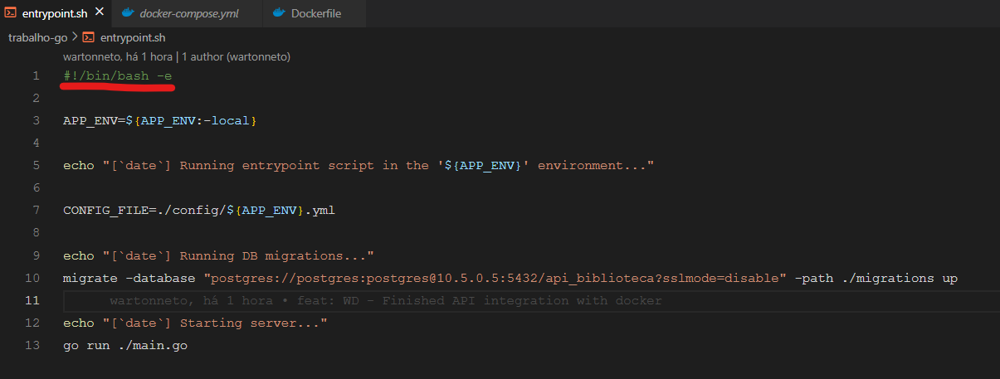
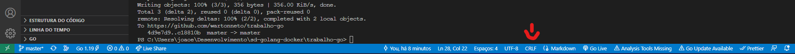

How to Run:

first you need to go to "configs.toml" and fill in with your configs.

after this, you need to do a "docker compose up" command so you'll get the docker image configurated in your pc.

after that you'll need the migrations, just run "docker run -v {your_entire_path_to_project}\migrations:/migrations --network host migrate/migrate -path=/migrations/ -database "postgres://127.0.0.1/api_biblioteca?sslmode=disable&user=postgres&password=postgres" up 1"

Then you can run the project with "go run.\main.go"

the default routes is 

POST http://localhost:9000/
GET http://localhost:9000/
GET http://localhost:9000/{id}
PUT http://localhost:9000/{id}
DELETE http://localhost:9000/{id}

example of raw POST:
    
    {
        "title":"Clean Code",
        "description":"Aprenda a programar! <3",
        "value": 150
    }

# Situação de exceção

Existe um caso de exceção gerado pela linha de código referenciada pelo sublinhado vermelho. O erro consiste no container do docker gerar um unhadled exception (unexpected line: -) que simplesmente é gerado pois o VSCODE possui dois sistemas de verificação de sintaxe de código (Imagem 2) chamados LF, e CRLF, a diferença entre os dois é:
    1- O caractere Carriage Return (CR) (0x0D, \r) move o cursor para o início da linha sem avançar para a próxima linha. Esse caractere é usado como um novo caractere de linha nos sistemas operacionais Commodore e Early Macintosh (OS-9 e anteriores).

    2- O caractere Line Feed (LF) (0x0A, \n) move o cursor para baixo para a próxima linha sem retornar ao início da linha. Este caractere é usado como um novo caractere de linha em sistemas baseados em UNIX (Linux, Mac OSX, etc)

    A sequência End of Line (EOL) (0x0D 0x0A, \r\n) é na verdade dois caracteres ASCII, uma combinação dos caracteres CR e LF. Ele move o cursor para baixo para a próxima linha e para o início dessa linha. Esse caractere é usado como um caractere de nova linha na maioria dos outros sistemas operacionais não Unix, incluindo Microsoft Windows, Symbian OS e outros.

Sabendo disto, para resolver o erro basta mudar o contexto natural do VSCODE de CRLF, para LF, assim a IDE não irá compreender que o executador do CMD no arquivo entrypoint.sh é um erro e assim executará corretamente.

